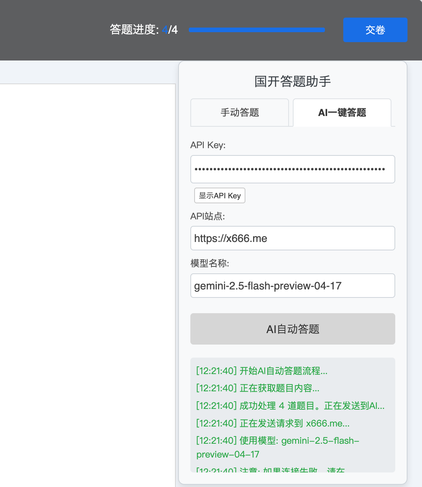
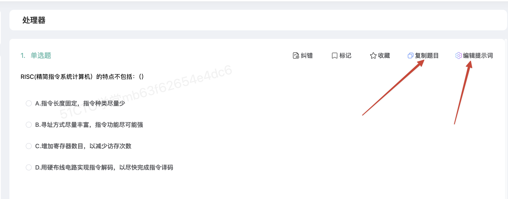
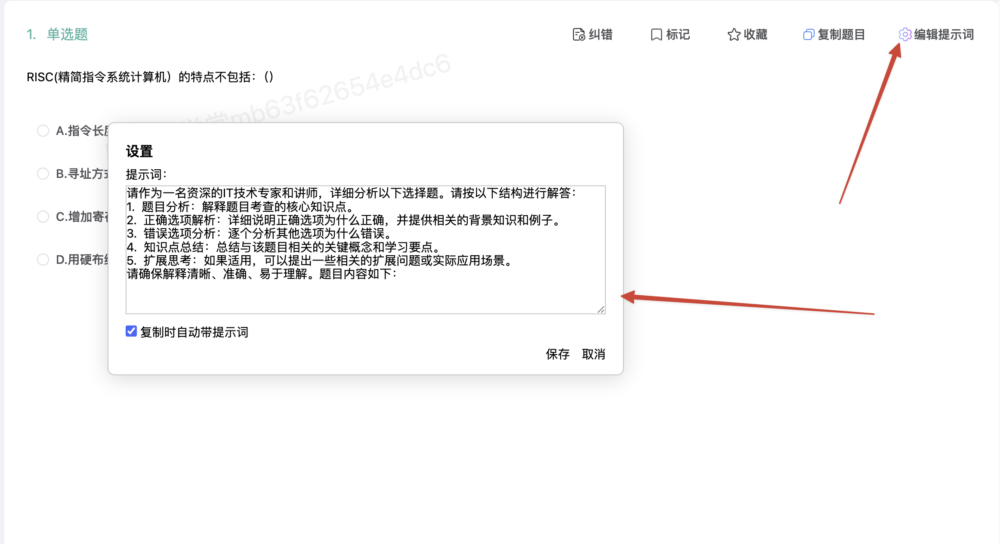

# 国开答题助手

## 脚本列表

### 国开答题助手.js
- 自动勾选答案：根据输入的答案自动在国开考试页面上勾选对应选项
- 一键复制题目：将考试题目复制到剪贴板，方便粘贴到AI工具中获取答案
- AI自动答题：将题目发送到AI，获取答案后自动勾选
- 提供简洁界面：在页面右上角添加操作面板
 

### 51CTO题目助手.js
- 支持复制题目到剪贴板（可选是否带提示词）方便粘贴到AI工具中获取答案
- 支持设置提示词
 